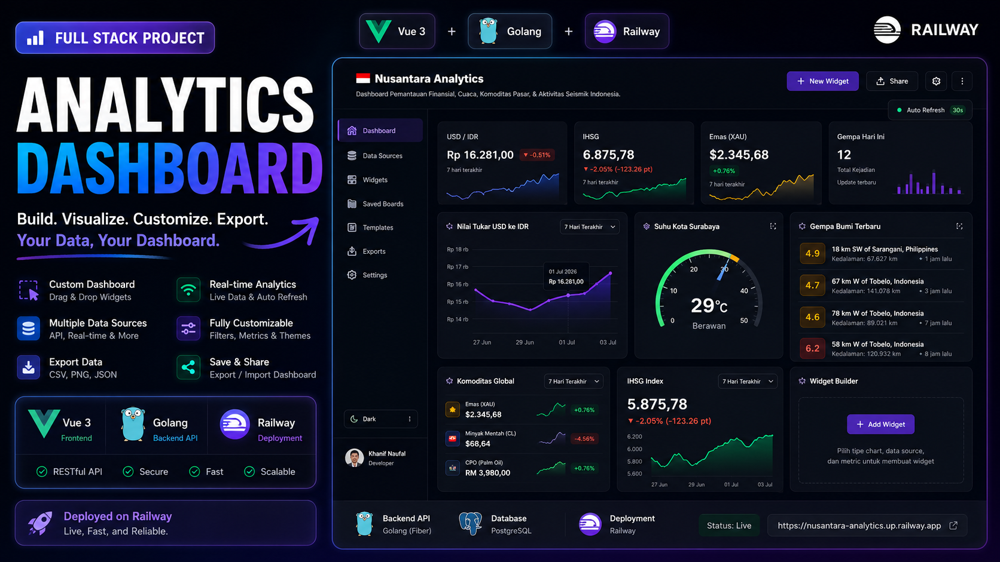

# Nusantara Analytics

> A customizable analytics dashboard platform built with **Nuxt 3**, **Go (Fiber)**, and **Chart.js**, allowing users to create, customize, and export their own real-time dashboards.


---

## ✨ Features

- 📊 Interactive Analytics Dashboard
- 🎨 Custom Dashboard Builder
- 📈 Multiple Chart Types
- 💱 Live Currency Exchange Rates
- 🌦️ Indonesian Weather Monitoring
- 📉 Indonesian Stock Market Overview
- 🛢️ Global Commodity Prices
- 🌍 Recent Earthquake Monitoring
- 📤 Export Charts as CSV & PNG
- 🎯 Drag & Arrange Widgets
- ⚡ Real-time Data Updates
- 🌙 Dark Modern UI

---

## 🖼️ Preview



```
/assets/dashboard-preview.png
/assets/custom-builder.png
```

---

## 🛠 Tech Stack

### Frontend

- Nuxt 3
- Vue 3
- Tailwind CSS
- Chart.js
- VueUse
- Pinia

### Backend

- Golang
- Fiber
- REST API

### Deployment

- Railway (Backend)
- Vercel (Frontend)

---

# 📁 Project Structure

```
nusantara-analytics/
│
├── backend/          # Go Fiber REST API
│
├── frontend/         # Nuxt 3 Application
│
├── README.md
│
└── ...
```

---

# 🚀 Getting Started

## Clone Repository

```bash
git clone https://github.com/yourusername/nusantara-analytics.git

cd nusantara-analytics
```

---

# ⚙ Backend Setup

Navigate to the backend folder.

```bash
cd backend
```

Install dependencies.

```bash
go mod tidy
```

Run the server.

```bash
go run main.go
```

The backend will be available at

```
http://localhost:8080
```

---

# 💻 Frontend Setup

Navigate to the frontend folder.

```bash
cd frontend
```

Install dependencies.

```bash
pnpm install
```

Run development server.

```bash
pnpm dev
```

Frontend will run at

```
http://localhost:3000
```

---

# 🔐 Environment Variables

### Frontend

Create

```
.env
```

```env
NUXT_PUBLIC_API_BASE=http://localhost:8080
```

---

# 🚀 Deployment

## Backend — Railway

1. Push this repository to GitHub.
2. Create a new Railway project.
3. Connect the GitHub repository.
4. Set the Root Directory to:

```
backend
```

5. Railway will automatically detect:

- Dockerfile
- railway.toml

Deploy and copy the generated Railway URL.

---

## Frontend — Vercel

1. Create a new Vercel project.
2. Connect the same GitHub repository.
3. Set the Root Directory to:

```
frontend
```

4. Add the following Environment Variable.

```env
NUXT_PUBLIC_API_BASE=https://your-backend.up.railway.app
```

5. Deploy.

---

# 📡 API

The frontend communicates with the Go backend through a REST API.

Example:

```
GET /api/weather

GET /api/currency

GET /api/stocks

GET /api/commodities

GET /api/earthquakes
```

---

# 📤 Export Options

Users can export dashboard data as:

- CSV
- PNG

More export formats are planned in future releases.

---

# 🤝 Contributing

Contributions, feature requests, and pull requests are welcome.

If you'd like to improve this project, feel free to fork the repository and submit a PR.

---

# 📄 License

This project is licensed under the MIT License.

---

## 👨‍💻 Author

**Muhammad Khanif Naufal**

GitHub:
https://github.com/khanifnaufal

Portfolio:
https://khanifnaufal.vercel.app